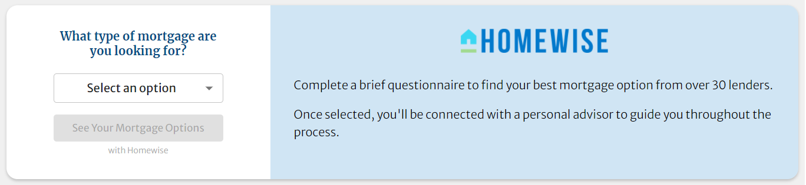
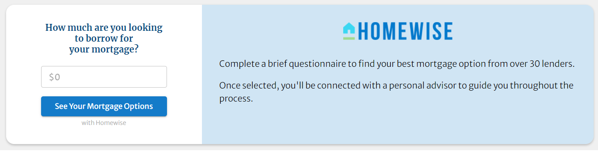
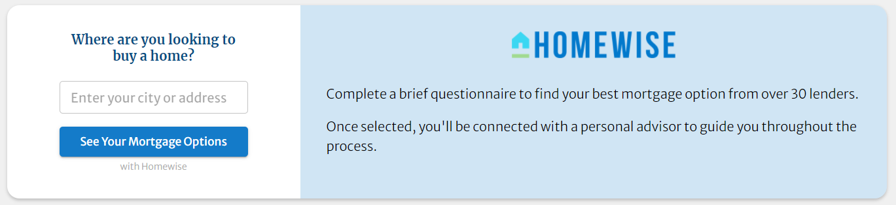

# Embed Homewise Banners
Thank you for partnering with Homewise!

This guide covers the steps to embed Homewise banners into your website. These widgets can be used throughout your
website to act as drivers to Homewise Online Application proper or a custom page that you maintain with a Homewise
Application embed.

## Installation

### Step 1
Complete [partner configuration](../partner/configuration.md).

### Step 2
Paste following line right after the `homewise` object. This loads the banner embed script.

```html
<script src="https://widgets.thinkhomewise.com/lib/com-banner/1.1/embed.js"></script>
```

#### Example
```html
<script>
  var homewise = {
    partner: {
      type: "p",
      code: "abc123",
      segment: "xyz789"
    }
  };
</script>
<script src="https://widgets.thinkhomewise.com/lib/com-banner/1.1/embed.js"></script>
```

#### Versions
Homewise will versions time to time introducing new features and bug fixes. We recommend that you use the latest version 
of embed script by changing the version number (e.g `/1.1/embed.js`). Following table shows available versions.

|            Version            | Notes                                       |
|:-----------------------------:|---------------------------------------------|
|              1.1              | Supports multiple banners on the same page. |
| [1.0](./archive/embed_1_0.md) | First version with all launch features.     |

### Step 3
Use following target class naming format where `N` is the position (index) of the configuration in the configuration 
array (see step 4 below). E.g. If 3 banners were configured, then the targets will be `homewise_banner_0`, 
`homewise_banner_1` and `homewise_banner_2`.
```html
<div class="homewise_banner_N"></div>
<!-- e.g. <div class="homewise_banner_0"></div>, <div class="homewise_banner_1"></div> -->
```


### Step 4
Optionally, customize the banner by adding `banner` configuration object with a single or multiple banner customization
configurations to the `homewise` default object.
> :warning: Please refer to browser's console for errors.

```html
<script>
  var homewise = {
    partner: { ... },
    banner: [
      {
        style: <string>,
        primaryColor: <string>,
        font: <boolean>,
        body: <boolean>,
        cta: <string>,
        link: <string>
      }
   ]
  };
</script>
```

#### Reference
| Property       | Required | Accepted Values                          | Default                        |
|----------------|:--------:|------------------------------------------|--------------------------------|
| `style`        |    N     | `homewise_1`, `homewise_2`, `homewise_3` | `homewise_1`                   |
| `primaryColor` |    N     | Any hexadecimal color code.              | `#147bc9`                      |
| `font`         |    N     | `true`,`false`                           | `true`                         |
| `body`         |    N     | Valid HTML wrapped with a `<p></p>` tag. | *Visible after embedding*      |
| `cta`          |    N     | Any string.                              | `See Your Mortgage Options`    |
| `link`         |    N     | Any URL.                                 | `https://my.thinkhomewise.com` |

> :bulb: Configure banners array with empty objects to render banner(s) using default values. E.g. 
> `homewise.banner = [{},{},{}]`

##### Notes
* `style` - Set the banner style you want. See below for a preview.
  * **Homewise 1** 
  * **Homewise 2** 
  * **Homewise 3** 
* `primaryColor` - Sets colors for buttons, borders and a calculated shade for the content area.
* `font` - Toggle standard font load. `false` will allow you to apply the font used your website's CSS.
* `body` - Overrides default body copy. Accepts standard HTML. Make sure your text is wrapped in a `<p></p>` tage to
  avoid incorrect spacing between text and the logo.
* `cta` - Set default CTA label.
* `link` - Set a custom click through URL. Assuming Homewise online application is embedded in this custom URL:
  * `hw_product` URL variable must be captured and send back to embedded app as `hw_product` URL variable.
  * `hw_state` URL variable must be captured and send back to embedded app as `state` URL variable.
  * `hw_segment` URL variable must be captured and send back to embedded app as part of the path before `/embed` bit.
    This segment value allows us to further group received applications.
    * _e.g. **with** `hw_segment` - `https://my.thinkhomewise.com/<partner_type>/<partner_code>/<hw_segment>/embed?state=<hw_state>` 
    (`https://my.thinkhomewise.com/p/abc123/xyz789/embed?state=aBc753dEf`)_
    * _e.g. **without** `hw_segment` - `https://my.thinkhomewise.com/<partner_type>/<partner_code>/embed?state=<hw_state>`.
    (`https://my.thinkhomewise.com/p/abc123/embed?state=aBc753dEf`)_

#### Example
```html
<script>
  var homewise = {
    partner: {
      type: "p",
      code: "abc123",
      segment: "xyz789"
    },
    banner: [
      {
        style: "homewise_1",
        primaryColor: "#ff824d",
        font: false,
        body: "<p>Connect with Homewise for a better mortgage!</p>",
        cta: "Learn More",
        link: "https://domain.com/page?foo=123&bar=456"
      },
      {
        style: "homewise_3",
        primaryColor: "#ff824d",
        font: false,
        body: "<p>Connect with Homewise for a better mortgage!</p>",
        cta: "Learn More",
        link: "https://domain.com/page?foo=159&bar=357"
      }
    ]
  };
</script>
<script src="https://widgets.thinkhomewise.com/lib/com-banner/1.1/embed.js"></script>
```

## Support
Contact Homewise Solutions Inc. at *hello[at]thinkhomewise.com* for support. Feel free to report any bugs you find via 
email or on GitHub.

**© Homewise Solutions Inc. All rights reserved.**

[Privacy Policy](https://thinkhomewise.com/page/privacy/) | [Terms of Agreement](https://thinkhomewise.com/page/term/).


